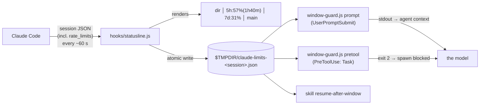

# Window guard: teaching the agent about its own rate limit

## The problem

On a Claude subscription, usage is metered in a rolling **5-hour window** (plus a weekly
one). When the window runs out mid-task, the session simply stops — often in the worst
possible place: halfway through a fan-out of five subagents, with nothing written down.

The model itself has no idea how much of the window is left. Claude Code *does* know —
it receives `rate_limits.five_hour.used_percentage` and `resets_at` from the API — but it
passes that data to exactly one place: **the status line command's stdin**. Hooks don't
get it. Skills don't get it. The model never sees it.

## The idea

Use the status line as a sensor, a temp file as a bus, and hooks as actuators.



1. **Sensor.** `hooks/statusline.js` renders the status line and, as a side effect,
   mirrors the limits into a per-session bridge file:
   ```json
   {"session_id":"…","five_hour_used_pct":57,"five_hour_resets_at":1790000000,
    "seven_day_used_pct":31,"seven_day_resets_at":1790500000,
    "ctx_remaining_pct":64,"ts":1789990000}
   ```
2. **Context injection.** On every user prompt, `window-guard.js prompt` reads the bridge
   and prints a line to stdout — which Claude Code appends to the model's context for
   that turn. The message escalates with usage:

   | 5h used | Injected into context |
   |---|---|
   | < 50% | nothing |
   | 50–69% | `[5h: 57% · resets 14:20]` (~15 tokens) |
   | 70–84% | ⚠️ split large tasks, spawn subagents sparingly, checkpoint more often |
   | ≥ 85% | 🔴 no subagents, finish the current step, write `HANDOFF.md`, wrap up |

3. **Hard stop.** `window-guard.js pretool` is a `PreToolUse` hook on `Task`. In the red
   zone it exits with code 2, which blocks the subagent spawn and shows the reason to the
   model — unless the window resets within 10 minutes anyway.

## Design decisions

**Per-session files, not one shared file.** A dozen idle sessions are usually open at
once, and each reports the limits of whatever upstream it last talked to (some go
through a local gateway). One shared file would be a race of writers with unrelated
numbers. The hook reads the file keyed by the `session_id` it receives on stdin.

**Atomic writes.** Write to `file.<pid>.tmp`, then `rename()`. A concurrent reader never
sees half a JSON document.

**Fail open, always.** Missing file, unparsable JSON, data older than 5 minutes — the hook
stays silent and exits 0. A monitoring feature must never be the reason work stops.

**Quiet below 50%.** Every injected line is paid for on every turn and dilutes the
context. Below the threshold the information changes no decision, so it is not sent.

**Absolute time in the compact line.** "resets 14:20" does not go stale during a long
turn, unlike "resets in 1h40m", and the agent can schedule a wake-up straight from it
(see `skills/resume-after-window`).

**Garbage collection.** Closed sessions never delete their bridge files. The status line
sweeps files older than an hour, at most once every 30 minutes (a sentinel file's mtime
throttles the sweep).

**Float hygiene.** `used_percentage` arrives as `7.000000000000001`; it is rounded for
display only, comparisons use the raw value.

## What else reads the bridge

- `skills/resume-after-window` — reads `five_hour_resets_at` to schedule a background
  `sleep` that wakes the session right after the reset (+3 min buffer) and continues work.

## Tuning

| Env var | Default | Meaning |
|---|---|---|
| `CC_WINDOW_QUIET` | 50 | below this, inject nothing (`0` = always inject) |
| `CC_WINDOW_YELLOW` | 70 | warning zone |
| `CC_WINDOW_RED` | 85 | block subagents |
| `CC_WINDOW_GRACE_MIN` | 10 | don't block if the reset is this close |
| `CC_WINDOW_STALE_SEC` | 300 | ignore bridge data older than this |
